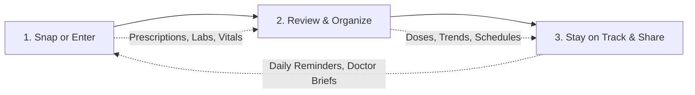

# 🌿 Medfolio — Your Personal Health & Prescription Vault
> **Version 4.0** · *Experience a fluid, living clinical vault with physics-based interactions, smart prescription scanning, intelligent dose scheduling, and doctor-ready medical briefs.*

---

## ✨ Overview

**Medfolio** is an intuitive, privacy-first personal health companion built for real everyday use. It bridges the gap between chaotic paper records and modern digital wellness by turning handwritten prescriptions, complex lab results, and daily medication routines into a clear, unified, and actionable health dashboard.

Whether managing chronic health conditions, caring for elderly parents, or keeping your family's medical history safe and organized, Medfolio ensures you never lose a prescription or miss a dose again.

---

## 🎯 What You Can Do With Medfolio

### 📸 1. Scan & Digitize Paper Prescriptions in Seconds
- **Snap & Extract**: Take a photo of any doctor's prescription or clinical discharge note. Medfolio’s AI instantly transcribes doctor handwriting, extracting drug names, dosage strengths, intake frequencies, and treatment durations.
- **Human-in-the-Loop Review**: You always have the final say. Review and verify extracted medicines before saving them to your active cabinet.
- **Organized Digital Archive**: Keep high-resolution prescription images alongside clean, structured digital entries for easy future retrieval.

### 💊 2. Smart Meal-Timed Medication Schedules & Dose Tracking
- **Automatic Dose Scheduling**: Automatically maps your prescriptions into realistic daily time buckets (Morning, Afternoon, Evening, Bedtime) aligned with your meal routines (*before meals* / *after meals*).
- **One-Tap Dose Logging**: Mark medicines as **Taken**, **Skipped**, or **Snoozed** with a single tap from your daily schedule.
- **PRN & As-Needed Cabinet**: Manage rescue medications (e.g., pain relievers, inhalers, antacids) separately with usage limits and frequency logging.
- **Refill & Inventory Warnings**: Get proactive reminders when your remaining pill count is running low.

### 🧪 3. Lab Test Visualizer & Biomarker Trends
- **Instant Lab Report Extraction**: Upload PDF or image lab reports (CBC, Lipid Profile, Liver Function, Renal Function, HbA1c, etc.).
- **Interactive Visual Trendlines**: Watch your biomarkers evolve over time with clear graphical trend charts.
- **Standard Clinical Reference Ranges**: Understand if your values are normal, optimal, or out-of-range with easy-to-read color cues.

### 🩺 4. Doctor-Ready Clinical Briefs & Instant Sharing
- **1-Page A4 Clinical Summary**: Print or export an ultra-clean, one-page health brief summarizing active medications, known allergies, chronic conditions, and recent lab results for your next clinic appointment.
- **PIN-Protected QR & Expirable Web Links**: Share a time-limited (24 hours, 7 days, or 30 days) read-only snapshot with your consulting physician via QR code or link, with instant revocation control.
- **Second Opinion Companion**: Prepare organized dossiers ready for specialist consultations without carrying heavy paper folders.

### 📈 5. Vitals & Symptom Diary with Emergency Red-Flag Triage
- **Log Essential Vitals**: Track Blood Pressure, Blood Sugar (Fasting / Post-Prandial), Heart Rate, Body Temperature, SpO2, and Weight.
- **Symptom Journaling**: Document symptoms, severity levels, and notes to give your doctor an accurate timeline of how you've been feeling.
- **🚨 Emergency Red-Flag Safety Alert**: Built-in safety screening flags critical emergency warning signs immediately on your device, providing direct one-tap dialing to emergency helplines.

### 💰 6. Medical Expense & Pharmacy Tracker
- **Track Healthcare Spending**: Keep a transparent record of doctor consultation fees, pharmacy bills, diagnostic lab charges, and insurance reimbursements.
- **Monthly Spending Insights**: View visual summaries of your monthly medical budget and recurring medication costs.

### 🤖 7. Friendly AI Health Assistant
- **Ask Health & Medicine Questions**: Wondering what a prescribed drug is for, how to store it, or general questions about a medical term? Get clear, patient-friendly explanations in plain language.
- **Multilingual Support**: Communicate in English, Urdu, or Roman Urdu for effortless local accessibility.

### 🛡️ 8. 100% Privacy-First & Offline Vault
- **Offline First**: Access your medication schedule, emergency contacts, and active prescriptions anytime—even when you have no internet connection.
- **Encrypted & Isolated**: Your health records are encrypted and protected by strict Row-Level Security. Your sensitive health data belongs exclusively to you.

---

## 🧭 How It Works in 3 Simple Steps



1. **Capture**: Upload or photograph your doctor's prescription, lab test report, or log daily vitals.
2. **Review**: Confirm details, customize your routine meal timings, and let Medfolio build your personalized schedule.
3. **Live Healthier**: Check off daily doses, monitor your biomarker trends, and present clear clinical briefs to your doctors with total confidence.

---

## 👥 Who Is Medfolio Built For?

- **Patients Managing Chronic Illnesses**: Keep long-term conditions like Hypertension, Diabetes, Thyroid disorders, and Cardiac health precisely tracked and monitored.
- **Family Caregivers**: Organize medications, dosages, and doctor notes for aging parents or children in one structured place.
- **Frequent Clinic Visitors**: Never forget to mention a current medication, past allergic reaction, or recent lab result to your doctor.
- **Health-Conscious Individuals**: Maintain a permanent, portable digital timeline of your personal wellness metrics.

---

## 🛡️ Medical Disclaimer & Safety Pledge

> **Important**: Medfolio is an assistive personal health organization and record management platform. It is **not** a licensed medical provider and does not provide medical diagnoses, treatment decisions, or autonomous medication modifications. Always consult your certified physician or healthcare specialist regarding any medical condition, symptom, or medication change.

---

## 🚀 Quick Launch (For Users & Self-Hosters)

Medfolio runs seamlessly in modern web browsers as a progressive web app (PWA) across mobile, tablet, and desktop devices.

```bash
# Clone the repository
git clone https://github.com/Hamzaisadev/Medfolio.git

# Enter project directory
cd "Medfolio v2"

# Install dependencies
npm install

# Start local server
npm run dev
```

Visit `http://localhost:5173` to start using your personal health vault.
